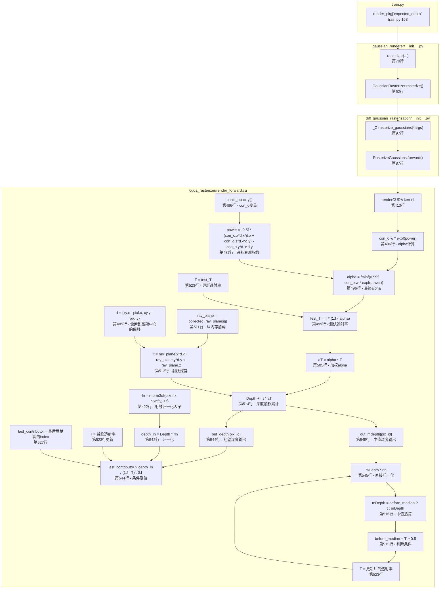
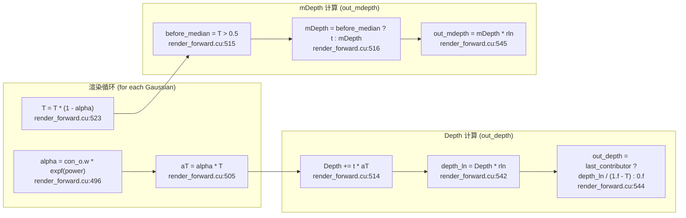
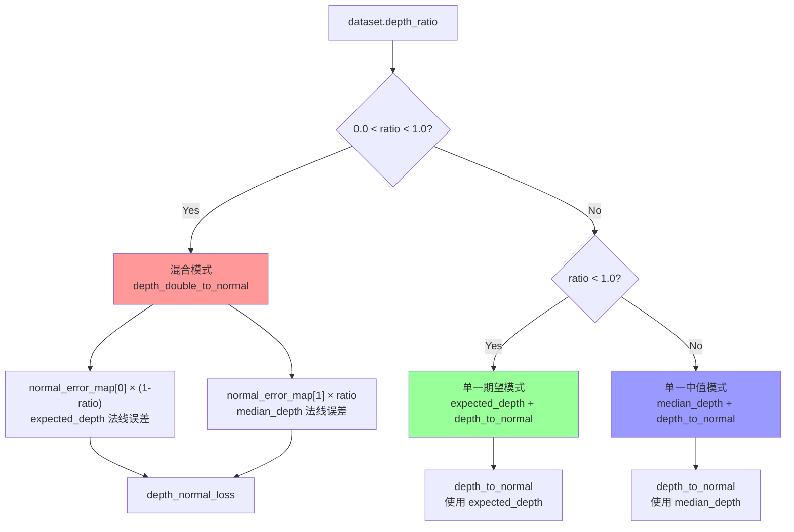

# Expected Depth 生成流程报告

## 1. 概述

`expected_depth` 是 3D Gaussian Splatting 渲染过程中计算的一个重要深度输出。它表示沿着射线方向的**加权深度期望**，用于深度正则化和法线估计等任务。

---

## 2. 调用链流程图



---

## 3. 详细代码位置

### Level 1: Python 接口层

| 文件 | 行号 | 说明 |
|------|------|------|
| `train.py` | 163 | `render_pkg["expected_depth"]` - 从渲染结果获取 |
| `gaussian_renderer/__init__.py` | 86 | `"expected_depth": rendered_expected_depth` - 构建返回字典 |
| `gaussian_renderer/__init__.py` | 70 | 调用 `rasterizer(...)` 获取渲染结果 |

### Level 2: Python 绑定层

| 文件 | 行号 | 说明 |
|------|------|------|
| `diff_gaussian_rasterization/__init__.py` | 97 | `_C.rasterize_gaussians(*args)` - 调用 CUDA 实现 |
| `diff_gaussian_rasterization/__init__.py` | 91-97 | 返回 `color, radii, depth, mdepth, alpha, normal` |

### Level 3: CUDA/C++ 实现层

| 文件 | 行号 | 说明 |
|------|------|------|
| `cuda_rasterizer/render_forward.cu` | 447 | `float Depth = 0` - 期望深度累计变量 |
| `cuda_rasterizer/render_forward.cu` | 448 | `float mDepth = 0` - 中值深度变量 |
| `cuda_rasterizer/render_forward.cu` | 422 | `rln = rnorm3df(pixnf.x, pixnf.y, 1.f)` - 射线归一化因子 |
| `cuda_rasterizer/render_forward.cu` | 442-451 | 辅助变量初始化 (T, contributor, last_contributor等) |
| `cuda_rasterizer/render_forward.cu` | 485 | `d = {xy.x - pixf.x, xy.y - pixf.y}` - 像素到高斯中心偏移 |
| `cuda_rasterizer/render_forward.cu` | 486 | `con_o = collected_conic_opacity[j]` - 从共享内存加载 |
| `cuda_rasterizer/render_forward.cu` | 487 | `power = -0.5f * (...) - con_o.y * d.x * d.y` - 高斯衰减指数 |
| `cuda_rasterizer/render_forward.cu` | 496 | `alpha = fminf(0.99f, con_o.w * expf(power))` - alpha 计算 |
| `cuda_rasterizer/render_forward.cu` | 499 | `test_T = T * (1.f - alpha)` - 测试透射率 |
| `cuda_rasterizer/render_forward.cu` | 505 | `aT = alpha * T` - 加权 alpha (核心!) |
| `cuda_rasterizer/render_forward.cu` | 510-521 | `if constexpr (GEOMETRY)` 块计算深度 |
| `cuda_rasterizer/render_forward.cu` | 511 | `ray_plane = collected_ray_planes[j]` - 加载射线平面 |
| `cuda_rasterizer/render_forward.cu` | 513 | `t = ray_plane.x*d.x + ray_plane.y*d.y + ray_plane.z` - 射线深度 |
| `cuda_rasterizer/render_forward.cu` | 514 | `Depth += t * aT` - **核心加权累计公式** |
| `cuda_rasterizer/render_forward.cu` | 515-516 | `mDepth = before_median ? t : mDepth` - 中值深度跟踪 |
| `cuda_rasterizer/render_forward.cu` | 523 | `T = test_T` - 更新透射率 |
| `cuda_rasterizer/render_forward.cu` | 541-545 | GEOMETRY 块输出深度结果 |
| `cuda_rasterizer/render_forward.cu` | 542 | `depth_ln = Depth * rln` - 归一化深度 |
| `cuda_rasterizer/render_forward.cu` | 544 | `out_depth[pix_id] = last_contributor ? depth_ln / (1.f - T) : 0.f` - **期望深度输出** |
| `cuda_rasterizer/render_forward.cu` | 545 | `out_mdepth[pix_id] = mDepth * rln` - **中值深度输出** |

---

## 4. 核心计算公式

### 期望深度 (expected_depth)

```cpp
float depth_ln = Depth * rln;
out_depth[pix_id] = last_contributor ? depth_ln / (1.f - T) : 0.f;
```

其中:
- `Depth`: 加权累计深度 = Σ(αᵢ × ∏ⱼ<ᵢ(1-αⱼ) × tᵢ)
- `T`: 最终透射率 = ∏ᵢ(1-αᵢ)
- `rln`: 射线归一化因子

物理含义: 沿射线方向的深度加权期望，类似于概率论中的加权平均。

### 中值深度 (median_depth)

```cpp
bool before_median = T > 0.5;
mDepth = before_median ? t : mDepth;
```

物理含义: 当透射率刚好降到 0.5 时对应的深度，即"中值"深度。

---

## 5. 数据结构对应关系

| Python 返回值 | CUDA 输出变量 | 计算位置 |
|---|---|---|
| `expected_depth` | `out_depth` | render_forward.cu:544 |
| `median_depth` | `out_mdepth` | render_forward.cu:545 |
| `normal` | `out_normal` | render_forward.cu:550-551 |
| `alpha` / `mask` | `out_alpha` | render_forward.cu:539 |

---

## 6. out_depth vs out_mdepth 详细对比

### 代码对比

```cpp
// render_forward.cu 第541-545行
if constexpr (GEOMETRY) {
    float depth_ln        = Depth * rln;                           // 共享归一化因子
    accum_depth[pix_id]   = depth_ln;                              // 累计深度 (归一化前)
    out_depth[pix_id]     = last_contributor ? depth_ln / (1.f - T) : 0.f;  // 期望深度
    out_mdepth[pix_id]    = mDepth * rln;                           // 中值深度
}
```

### 本质区别

| 特性 | out_depth (expected_depth) | out_mdepth (median_depth) |
|------|---------------------------|---------------------------|
| **计算方式** | `Depth * rln / (1 - T)` | `mDepth * rln` |
| **含义** | 加权期望深度 | 中位数深度 |
| **统计指标** | 均值 (Mean) | 中位数 (Median) |
| **数学公式** | Σ(wᵢ × tᵢ) / Σ(wᵢ) 其中 wᵢ = αᵢ∏(1-αⱼ) | 当 T=0.5 时的 t 值 |
| **T 的作用** | 用作归一化因子 (1-T = α_sum) | 用作中值判断条件 |
| **最后贡献者** | 必须 `last_contributor > 0` 才输出 | 直接输出，无条件 |

### 深度累计过程 (以 out_depth 为例)

```
第1个Gaussian: Depth = t₁ × α₁ × T₀     (T₀ = 1.0, 初始透射率)
第2个Gaussian: Depth = t₁×α₁×T₀ + t₂×α₂×T₁
第3个Gaussian: Depth = t₁×α₁×T₀ + t₂×α₂×T₁ + t₃×α₃×T₂
...
最终: Depth = Σ(tᵢ × αᵢ × ∏ⱼ<ᵢ(1-αⱼ))

输出: out_depth = Depth × rln / (1 - T)
     其中 T = ∏(1-αᵢ) (最终透射率)
     其中 1-T = Σ(αᵢ × ∏(1-αⱼ)) (总遮挡率)
```

### 中值深度追踪过程 (以 out_mdepth 为例)

```
初始: T = 1.0 (透射率100%), mDepth = 0

第1个Gaussian贡献后: T = 1 - α₁
  → if T > 0.5 (即α₁ < 0.5), mDepth = t₁

第2个Gaussian贡献后: T = (1-α₁)(1-α₂)
  → if T > 0.5, mDepth = t₂
  → else 保持 mDepth = t₁

...持续追踪直到 T <= 0.5

最终: mDepth = 当T刚好<=0.5时的那个t值
输出: out_mdepth = mDepth × rln
```

### 图示对比

```
射线方向 ─────────────────────────────────────────────────────►

Gaussians:    G₁        G₂        G₃        G₄        G₅
Alpha:        α₁        α₂        α₃        α₄        α₅

累计遮挡:    [======]  [==========]  [================]

T 透射率:    1.0  →  0.7  →  0.4  →  0.2  →  0.05  →  0.01
              │      │      │      │
              │      │      │      └─ T <= 0.5, mDepth = t₄ (中值)
              │      │      │
              │      │      └─ T > 0.5, continue
              │      │
              │      └─ T > 0.5, mDepth = t₂
              │
              └─ 初始状态

out_depth:  (t₁×w₁ + t₂×w₂ + t₃×w₃ + t₄×w₄ + t₅×w₅) / (1-T)
out_mdepth: t₄ × rln (当T刚好<=0.5时的深度)
```

---

## 8. 变量依赖完整流程图



### 使用场景

根据 `train.py:172`:
```python
depth_map = rendered_expected_depth if dataset.depth_ratio < 1.0 else rendered_median_depth
```

- 当 `depth_ratio < 0.5` 时使用 `expected_depth`
- 当 `depth_ratio >= 0.5` 时使用 `median_depth`

---

## 9. `depth_ratio` 参数详解

### 9.1 参数定义位置

| 文件 | 行号 | 默认值 | 说明 |
|------|------|--------|------|
| `arguments/__init__.py` | 63 | `0.0` | 参数定义 |

```python
# arguments/__init__.py 第62-63行
# self.depth_ratio = 0.6  # 注释掉的示例
self.depth_ratio = 0.0     # 默认值
```

用户可通过命令行传入，例如 `--depth_ratio 0.6`

---

### 9.2 `depth_ratio` 在训练框架中的控制作用

`depth_ratio` 是一个 **0.0~1.0** 之间的浮点数，用于控制深度相关的多个行为：

#### 作用一: 法线损失计算 (`train.py:166-175`)

```python
# train.py 第166-175行
if 0.0 < dataset.depth_ratio < 1.0:
    # 混合模式: 同时使用 expected_depth 和 median_depth
    depth_normal = depth_double_to_normal(viewpoint_cam, rendered_expected_depth, rendered_median_depth)
    normal_error_map = 1 - torch.linalg.vecdot(rendered_normal.unsqueeze(0), depth_normal, dim=1)
    # 加权混合两种深度的法线误差
    depth_normal_loss = (1 - dataset.depth_ratio) * normal_error_map[0].mean() + dataset.depth_ratio * normal_error_map[1].mean()
    depth_normal = None
else:
    # 单一模式: 根据 depth_ratio 选择使用 expected_depth 或 median_depth
    depth_map = rendered_expected_depth if dataset.depth_ratio < 1.0 else rendered_median_depth
    depth_normal = depth_to_normal(viewpoint_cam, depth_map)
    normal_error_map = 1 - torch.linalg.vecdot(rendered_normal, depth_normal, dim=0)
    depth_normal_loss = normal_error_map.mean()
```

**三种情况:**
| depth_ratio 值 | 模式 | 使用的深度 | 说明 |
|---------------|------|-----------|------|
| `0.0` | 单一期望模式 | expected_depth | 只用法线一致性损失 |
| `0.0 < x < 1.0` | 混合模式 | expected_depth + median_depth | 用 `depth_double_to_normal` 结合两者 |
| `1.0` | 单一中值模式 | median_depth | 只用中值深度 |

#### 作用二: 深度图选择 (`train.py:172`, `mesh_extract.py:44`, `geometry_metric.py:25`, `mesh_extract_tnt.py:155`)

```python
# train.py:172
depth_map = rendered_expected_depth if dataset.depth_ratio < 1.0 else rendered_median_depth

# mesh_extract.py:44
depth_name = "expected_depth" if dataset.depth_ratio < 0.5 else "median_depth"

# geometry_metric.py:25
depth_name = "expected_depth" if dataset.depth_ratio < 0.5 else "median_depth"
```

**注意:** `train.py:172` 用 `< 1.0` 判断，而 `mesh_extract.py`/`geometry_metric.py` 用 `< 0.5` 判断。这是因为:
- 训练时: `depth_ratio < 1.0` 意味着用 expected_depth (因为 0.0 是默认值)
- 评估时: `depth_ratio < 0.5` 意味着用 expected_depth (更偏向用它)

---

### 9.3 为什么用 0.5 作为分界线判断使用期望深度或中值深度

#### 统计特性分析

| 深度类型 | 统计含义 | 特性 | 适用场景 |
|---------|---------|------|---------|
| **expected_depth** | 加权均值 (Mean) | 对异常值敏感，更"平滑" | 当深度噪声较大、需要平滑估计时 |
| **median_depth** | 中位数 (Median) | 对异常值鲁棒，更"锐利" | 当有少量异常深度、追求精确表面时 |

#### 0.5 的物理含义

```cpp
// render_forward.cu 第515行
bool before_median = T > 0.5;
```

- `T` 是透射率 (transmittance)，表示光线穿过当前所有 Gaussian 后还剩多少比例没有被遮挡
- `T > 0.5` 意味着当前累计遮挡率 `< 50%`
- `mDepth` 记录的是当 `T` 刚好从 **大于0.5变为小于等于0.5** 时那个 Gaussian 的深度

**换句话说:** `median_depth` 记录的是"光线走到一半时被遮挡了50%"时的深度，这是一个具有 **物理意义的中点**。

#### 选择 0.5 作为分界的原因

1. **对称性**: `T = 0.5` 是透射率和遮挡率的平衡点，在物理上具有对称意义
2. **鲁棒性**: 中值深度对噪声更鲁棒，适合作为深度真值的替代
3. **互补性**: 期望深度 (均值) 和中值深度有各自的优势，`depth_ratio` 允许用户在两者之间权衡

#### 实际影响

```python
# train.py:169 - 混合模式下的加权
depth_normal_loss = (1 - dataset.depth_ratio) * normal_error_map[0].mean() + dataset.depth_ratio * normal_error_map[1].mean()
```

| depth_ratio | 期望深度权重 | 中值深度权重 | 效果 |
|-------------|-------------|-------------|------|
| 0.0 | 100% | 0% | 期望深度主导 |
| 0.3 | 70% | 30% | 偏期望 |
| 0.5 | 50% | 50% | 两者均衡 |
| 0.7 | 30% | 70% | 偏中值 |
| 1.0 | 0% | 100% | 中值深度主导 |

---

### 9.4 `depth_ratio` 控制逻辑总览图



---

### 9.5 关键代码汇总

| 使用场景 | 文件 | 行号 | 代码 |
|---------|------|------|------|
| 参数定义 | `arguments/__init__.py` | 63 | `self.depth_ratio = 0.0` |
| 训练时法线损失 | `train.py` | 166-169 | `depth_double_to_normal` + 加权混合 |
| 训练时深度选择 | `train.py` | 172 | `expected_depth if < 1.0 else median_depth` |
| 网格提取 | `mesh_extract.py` | 44 | `expected_depth if < 0.5 else median_depth` |
| 几何度量 | `geometry_metric.py` | 25 | `expected_depth if < 0.5 else median_depth` |
| Tetra网格提取 | `mesh_extract_tnt.py` | 155 | `expected_depth if < 0.5 else median_depth` |